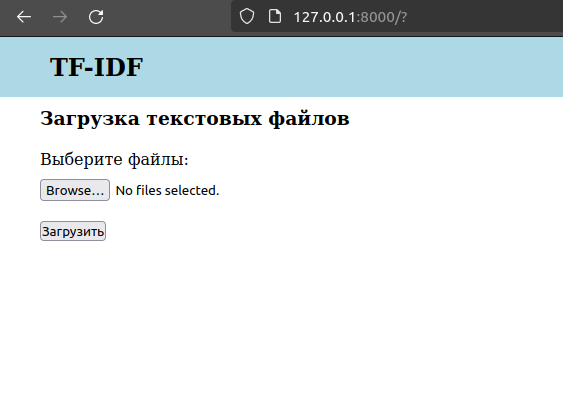
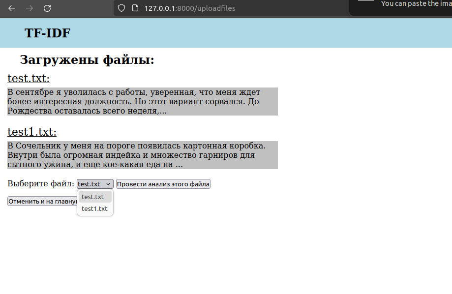
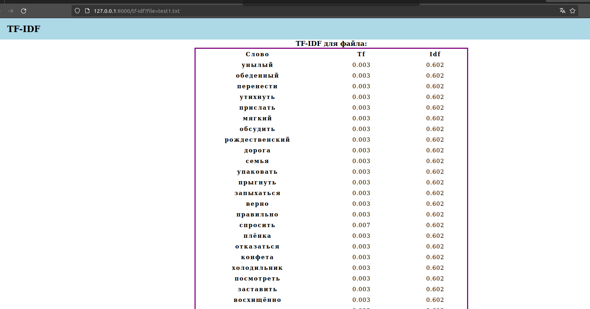

## Тестовое задание на позицию Intern Web Developer (Python)
Реализовать веб-приложение. В качестве интерфейса сделать страницу с формой для загрузки текстового файла, после загрузки и обработки файла отображается таблица с 50 словами с колонками:
- слово
- tf, сколько раз это слово встречается в тексте
- idf, обратная частота документа 

Вывод упорядочить по уменьшению idf.
___

Приложение выполнено с использованием следующих инструментов:
* Язык Pyhon 3.10, фреймворк FastAPI
* Jinja2
* Лемматизация текста проводится с помощью pymorphy2
* Стоп-слова из пакета stop-words.

### Запуск приложения

1. Клонировать репозиторий:
    ```
    git clone https://github.com/amoglock/lesta_Web_Intern.git
    ```
2. Установить и активировать виртуальное окружение:
    ```
    python3 -m venv venv
    source venv/bin/activate - Linux
    source venv/Scripts/activate  - Windows
    ```
3. Установить зависимости:
    ```
    pip install -r requirements.txt
    ```
   
4. Запустить проект:

   Перейти в папку с репозиторием или открыть в IDE. В командной строке ввести
    ```
    uvicorn main:app
    ```
   Приложение будет доступно по адресу http://127.0.0.1:8000/

### Работа приложения

На начальной странице загружаются текстовые файлы. Приложение работает только с форматом .txt.

<div style="align-items: center;">
  <a href="./images/main_page.png" style="display: block; margin: 0 auto;">
    
  </a>

После загрузки файлов, отображается название файла и его содержимое (первые 150 символов). 
Выбрать файл для анализа нужно из всплывающего меню.

<div style="align-items: center;">
  <a href="./images/choosing_file.png" style="display: block; margin: 0 auto;">
    
  </a>

Результат выдается в виде таблицы.

<div style="align-items: center;">
  <a href="./images/result_table.png" style="display: block; margin: 0 auto;">
    
  </a>
